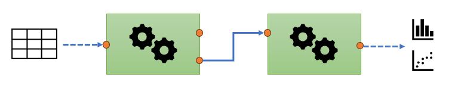

# Workflows, templates and objects

:::: {.learn .panel}

::: content
- Learn how a data processing workflow is defined in the context of this course
- Learn about templates and objects defined by the `struct` package
- Interact with some of the base objects/templates from the `struct` package
:::

::::

## What is a data processing workflow?
There many definitions of a workflow, so its useful to be specific about what we mean by a workflow in this course. 

Here, a workflow is a sequence of steps, or modules, where each step implements a different data processing step. 

For example, one step in the workflow might be to normalise the data, another to scale it. The workflow steps can be connected in any order, and the data flows into one step, is processed, and then the output is used as an input to the next step. For this example, the raw data would be first normalised, and the normalised data would then be scaled.

:::: {.task .panel}

::: title
Your workflow
:::

::: content
- What data processing steps do you think you might need for your workflow?
- What statistical analysis might you like to include as part of your workflow?
:::
  
::: {.expandable .hint}
Suggestions
:::

::: {.content .collapsed}
- Quality filtering, normalisation, scaling, transformation, imputation
- Univariate significance tests, multivariate visualisation
:::

::::

## Templates and Objects
As you will already have seen, there is a large number of R packages. This is one of the great strengths of R. However, when writing code to carry out a number of workflow steps it can be difficult to integrate all of the required packages to together in a way that is transparent and reproducible.

The `struct` package tries to address this by defining a number of “templates”. These templates define what the data structure should be, how data will flow in and out of a workflow step, and which output is transferred to the input of the next object.

In the figure below the green boxes represent workflow steps. Data flows in and out of the workflow steps before finally generating some charts. Each workflow step uses the same basic template, but applies a different data processing step by overriding the template defaults.



None of the templates in `struct` implement any data processing steps, they only define what a step should look like. The idea is that other packages can implement their code inside a template to make it compatible with other workflow steps. For example, the `structToolbox` package uses the `struct` templates to convert processing steps from other packages into workflow steps using templates. All workflow steps are then compatible with each other, and you no longer need to worry about how to implement the steps, you can focus on what steps to use and in what order.

### Template slots
Slots, or fields, of a template are how `struct` defines the content of a template. All `struct` templates have a `name` and a `description` slot. They also have a `citation` slot that contains a list of relevant literature in BibTeX format, a `libraries` slot naming any additional packages needed to use the object, and an `ontology` slot that provides links to FAIR descriptions of the method(s) implemented by the template.

`struct` also provides a mechanism to flexibly include additional slots in the form of input parameters `params` and output parameters `outputs`. Input and output slots are specific to the method being implemented by the template. 

For example a "Principal Component Analysis" template might include a "number_of_components" slot for the user to specify how many components to use in the computation. 

The results of a computation will be put in output slots; until the object is used with some data the output slots will be empty. For the PCA example, the computed component scores might be stored in the `scores` output slot.

You will find out how to apply computations to a DatasetExperiment later in the course.

### Template methods
As well as the templates `struct` also provides a number of “methods” for each template. Methods are functions that change how they work depending on the input template. Some methods defined by `struct` enable easy access to inputs and outputs of the templates, while others, such as `show`, define what is displayed when the template is printed to the console.

`struct` defines a `$` method that allows you to easily get and set slot values. You will see examples of this in the next section.

## Working with Templates and Objects
All templates "inherit" functionality from parent templates. You can list the inherited templates for an object using the `is` function. As an example here we show the inherited templates of the `PCA` template.

```{r}
# inheritance of PCA
is(PCA())
```

All struct templates have `struct_class` as a parent, so the methods defined for this template will work for all struct templates. You will learn about some of the other templates in later modules.

You will never normally use the `struct_class` template directly, but we can use it here to demonstrate some of the features of a template. To initialise an instance of a template you use its name as a function call. When a template is initialised it becomes an “object”. You can print the details of an object to the console using the `show` command.

```{r}
# create an instance of a struct_class template
SC = struct_class()

# print to console
show(SC)
```

We can access slots of the object using dollar notation. For example here we change the values of the `name` and description slots:

```{r}
SC$name = 'example name'
SC$description = 'example description'
show(SC)
```

You can also set slot values when intialising the object e.g:

```{r}
SC = struct_class(
        name = 'second example name', 
        description = 'second description')
show(SC)
```
This approach will be used a lot when creating workflows in later modules.


## Exercise

::: {.task .panel}

:::: title
Exploring the `PCA` object
::::

:::: content
In this exercise you will test your understanding of `struct_class` objects 
using a `PCA` object, which is based on the `struct_class` template. You will find out 
more about  the `PCA` object later in the course.
::::

::: {.expandable}
Tasks
:::

::: {.content .collapsed}
1. Create a new `PCA` object using the `PCA()` command.
2. Print a summary of the object to the console.
3. How many output parameters does the PCA object have?
4. What kind of parameter is `number_components`?
5. How many components are set by default?
6. Change the number of components to 10.
7. How do we initialise a PCA object with 8 components?
8. What do you think will happen if you try to set `number_components = "cake"`? Why does this happen?
:::

:::: {.expandable .hint}
Hints
::::

:::: {.content .collapsed}
- make sure you have activated the `structToolbox` library
- methods that work for `struct_class` objects will work for any object based off of that template 
::::

:::: {.expandable .answer}
Solutions
::::

:::: {.content .collapsed}

1. We can initialise a PCA object in a similar way to `struct_class` was initialised in the course text. Here we store it as `M` in the environment.

    ```{r}
    M = PCA()
    ```

2. We can use the `show` method to print the object to console.

    ```{r}
    show(M)
    ```

3. The console output indicates that the PCA object has 6 output slots.

4. The `number_components` slot is an input parameter.

5. We can retrieve the value of the `number_components` slot using dollar notation.

    ```{r}
    M$number_components
    ```

6. We can also set the value of the `number_components` slot using dollar notation.

    ```{r}
    M$number_components = 10
    ```

7. We can set a value for slot by specifying it inside the call to create the object.

    ```{r}
    M = PCA(number_components = 8)
    ```

8. You will receive an error when trying to set `number_components = "cake"`. This is because the PCA template requires that `number_of_components` is either a `numeric` or an `integer`. You can see this in the documentation (e.g. `?PCA`).

::::

:::


